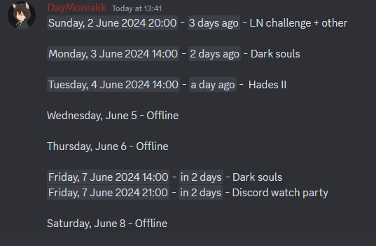

# Stream Scheduler

A tool that I created for the twitch streamer [nan7s_peluche](https://www.twitch.tv/nan7s_peluche).

It aims to quickly create stream schedules that can be paste on a Discord channel.

No confusion possible: the schedule will be displayed in your own timezone !




## Info

Built using the front-end framework [Svelte](https://svelte.dev/).

By default the project is setup to be deployed to [Netlify](https://www.netlify.com/).


## Known Issues

Looks terrible on smaller screens like smartphones but I can't be bothered right now.


## Run Locally
Install dependencies

```bash
  npm install
```

Start the server

```bash
  npm run --dev --open
```

Build for Netlify

```bash
  npm run build
```
